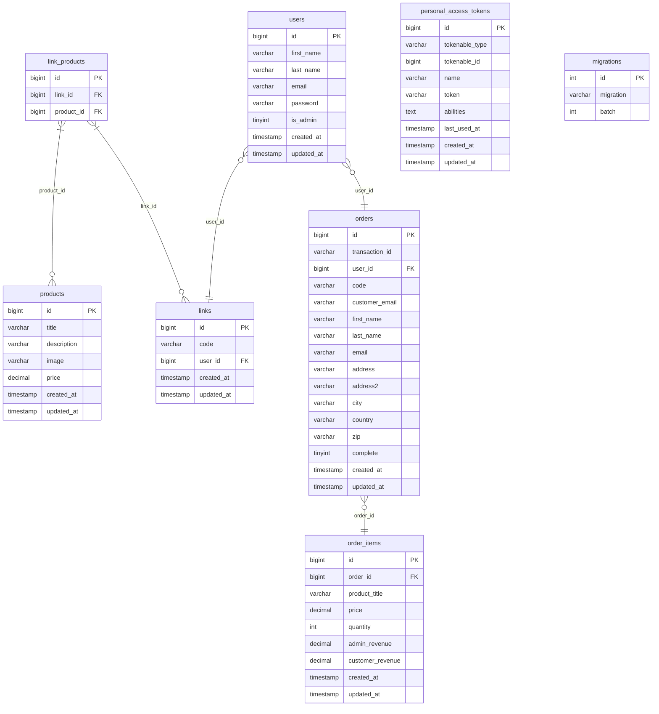

## Laravel Ambassador (Monolith)
You can see most of the endpoints and its bodies down below:

[](https://god.gw.postman.com/run-collection/16889380-bf1a7826-d54f-4e33-ae05-6d2385ebd87d?action=collection%2Ffork&source=rip_markdown&collection-url=entityId%3D16889380-bf1a7826-d54f-4e33-ae05-6d2385ebd87d%26entityType%3Dcollection%26workspaceId%3Db10972d8-d348-4dad-a75c-df1938ec825e)

Try to interact locally with the frontend:

[Admin](https://github.com/devkiloton/vue-admin) (don't forget to setup `VUE_APP_API_URL` in the `.env`)

[Checkout](https://github.com/devkiloton/nuxt-checkout) (use a `code` from any link in the db as a route param to make the checkout and set Stripe credentials in the config)

### Running the project
First things first, setup the environment variables, the `.env.example` is equal to the `.env` excepting the Stripe credentials that you must to create and the `MAIL_HOST` variable that you must to define based on you local machine (default is `docker.for.mac.localhost`).

Install Node.js deps:
```
npm i
```
Install PHP deps:
```
composer install
```
Install the mailhog [here](https://github.com/mailhog/MailHog) to run a mail server locally and then start it with:
```
mailhog
```
Create and start the containers:
```
docker-compose up
```
Access the backend terminal:
```
docker-compose exec backend sh
```
Inside the backend terminal, mock the db with the seeds:
```
php artisan db:seed
```
Now, leave the backend terminal and start the application:
```
php artisan serve
```
### Database diagram


